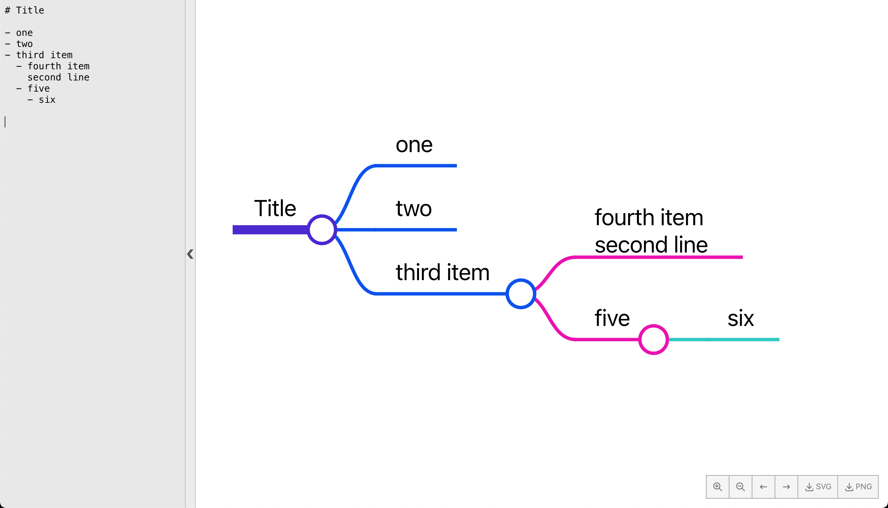

# Markmap Editor

Create MindMap diagrams just by typing out Markdown!

Write out nested headings or lists to display the text in a structured mindmap diagram.

Web interface hosted here 👉 https://billthornton.github.io/markmap-editor/

## Features

- Create a mindmap just by entering Markdown text
- Shareable URL
- Collapsable sidebar
- Zoom controls
- Save as PNG and SVG files
- Controls to collapse a level of nodes to 'walk-through' a diagram (left and right arrow controls)
- Collapse/Expand adjacent nodes (hold alt when clicking on the circle next to a node)
- Collapse/Expand a complete node tree (hold shift when clicking on the circle next to a node)

## Future features

- Export with embedded data for import
- Import from exported file

## Credits / Dependencies

This couldn't be done without these great projects below:

- [Markmap](https://github.com/gera2ld/markmap)
  - [d3-flextree](https://github.com/Klortho/d3-flextree)
  - [d3](https://github.com/d3/d3)
- [dom-to-image-more](https://github.com/1904labs/dom-to-image-more)
- [tabler-icons](https://github.com/tabler/tabler-icons)
